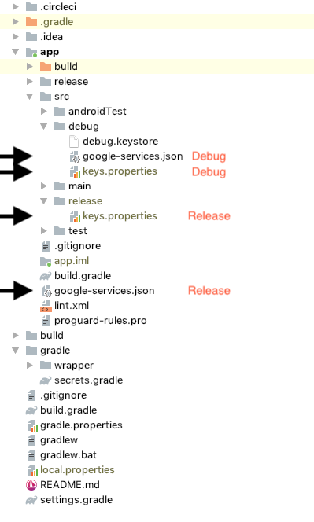

# Outage Android

This is the main repository for My ATCO Electricity Android app.

CircleCI Unit Tests: [](https://circleci.com/bb/ATCOCorporateDigitalPlatforms/outage-android)

AppCenter UI Tests Dev: [](https://appcenter.ms/orgs/Electricity/apps/My-ATCO-Electricity-1/build/branches/dev)

AppCenter UI Tests Master: [](https://appcenter.ms/orgs/Electricity/apps/My-ATCO-Electricity-1/build/branches/master)


### Installation

```bash
$ git clone git@bitbucket.org:ATCOCorporateDigitalPlatforms/outage-android.git
```

### Required External Files

The indicated files may or may not be in this repository, but are required in order to build/run the project. Before building the project, retrieve any required files from **Teams** or **Firebase** and copy to indicated locations. The required build files for each variant are listed below



### Build Variants

There are currently four build variants:

###### Debug

- Dev Environment
- Uses **Debug** build files/variables
- Debug Signing
- No minifying/encrypting
- VersionName with “-debug” suffix

##### Alpha

- Same as Debug in all aspects
- Uses **Debug** build files/variables
- VersionName with “-alpha” -suffix
- Intended for team internal testing

##### Beta

- Same as Alpha except Production environment
- Uses **Release** build files/variables
- VersionName with “-beta” suffix
- Intended for company internal testing

##### Release

- Production Environment
- Uses **Release** build files/variables
- Signed
- Minified (TBD)
- No versionName suffix


### Building & Testing

We use CircleCI for Unit Testing and AppCenter for UI Testing and Release version management.

##### Unit Testing

All pushes/merges to `dev` branch must pass Unit Testing on Circle CI. Direct writing to `dev` is not allowed. Test results are reported in BitBucket and via email.

##### UI Testing

On successful pushes to `dev`, `alpha`, `beta`, or `master` branches, App Center is configured to run UI Testing automatically and report test results in App Center and via email.

### Alpha/Beta/Release Tracks

##### Alpha 
App Center is configured to automatically merge to `alpha` on successful push to `dev` branch, increment the app `versionCode` based on current system time, build and run tests, and if all passes, distribute to `Alpha Testing` group.

##### Beta
App Center is configured to automatically merge to `beta` on successful push to `alpha` branch, build and run tests, and if all passes, distribute to `Beta Testing` group.

##### Release
App Center is **not** configured to merge to `master` automatically. Pushes to `master` must be done manually via Pull Request. On successful push, App Center will build and run tests, and if all passes, sign and create an APK for distribution, but will not distribute automatically. App must be distributed manually via Play Store.
‌